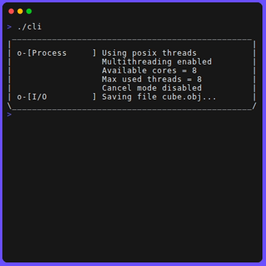
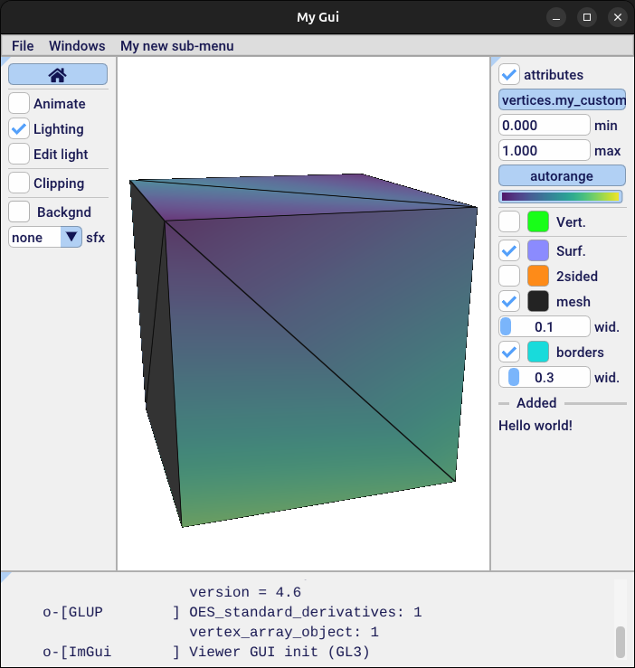

# Geogram boilerplate

Get you up and running with the [Geogram](https://github.com/BrunoLevy/geogram) library

[](https://gist.github.com/cheerfulstoic/d107229326a01ff0f333a1d3476e068d)

CLI ([apps/cli.cpp](./apps/cli.cpp)) | GUI ([apps/gui.cpp](./apps/gui.cpp))
:-:|:-:
|

## Requirements

- [CMake](https://cmake.org/)
- a C++ 20 compiler discoverable by CMake

## Clone, build & run

**1. Clone with submodules**

```bash
git clone --recurse-submodules https://github.com/LIHPC-Computational-Geometry/geogram-boilerplate.git
cd geogram-boilerplate
```

<details>
<summary>If you forgot <code>--recurse-submodules</code></summary>

```bash
# inside the geogram-boilerplate repo
git submodule init
git submodule update
cd ext/geogram
git submodule init
git submodule update
cd ../..
```

See https://git-scm.com/book/en/v2/Git-Tools-Submodules#_cloning_submodules

</details>

**2. Create a build directory**

```bash
mkdir build
cd build
```

**3. Generate the Makefile and compile**

```bash
cmake .. # the CMakeLists.txt is in the parent folder
make
```

<details>
<summary>To configure a release build, instead of a debug build</summary>

Add `-DCMAKE_BUILD_TYPE=Release` to the CMake command:
```bash
cmake .. -DCMAKE_BUILD_TYPE=Release
make
```

Better: create a build folder for each build type, like `build_debug/` & `build_release/`, and update the [.gitignore](.gitignore)

</details>

<details>
<summary>To use <a href="https://ninja-build.org/">Ninja</a> instead of Make</summary>

Add `-G Ninja` to the CMake command:
```bash
cmake .. -G Ninja 
ninja
```

</details>

**4. Execute**

```bash
# for the command-line interface example
./cli

# for the graphical user interface example
./gui
```

## Customize the project

- [ ] Rename the project in [CMakeLists.txt](CMakeLists.txt) (the `project()` directive)
- [ ] Rename the executables. To do so, you have to rename the `apps/*.cpp` files, and update accordingly [CMakeLists.txt](CMakeLists.txt) directives `add_executable()`, `target_include_directories()` and `target_link_libraries()`. To rename the GUI window title, change the value passed to the `SimpleMeshApplication` constructor.
- [ ] Change the [LICENSE](LICENSE)
- [ ] Overwrite this README

## Update Geogram

```bash
cd ext/geogram
git pull
# then `git checkout ...` if you want to target a specific commit/version
```

## Step-by-step project creation

If you want to add Geogram to an existing project, you may find useful this step-by-step guide to recreate this boilerplate repo.

<details>
<summary><b>1. Hello world in C++</b></summary>

Create `apps/cli.cpp`:
```c++
#include <iostream>

using namespace GEO;

int main(int argc, char** argv) {
	std::cout << "Hello world!" << std::endl;
    return 0;
}
```

</details>

<details>
<summary><b>2. Basic CMakeLists.txt</b></summary>

Create `CMakeLists.txt`:
```CMake
cmake_minimum_required(VERSION 3.5)

project(boilerplate-geogram)

set(CMAKE_CXX_STANDARD 20)
set(CMAKE_CXX_STANDARD_REQUIRED ON)

#################
# EXECUTABLES
#################

add_executable(cli apps/cli.cpp)
```

See the beginning of the README on how to build and run the program.

</details>

<details>
<summary><b>3. Add Geogram as submodule</b></summary>

```bash
mkdir ext
cd ext
git submodule add https://github.com/BrunoLevy/geogram.git # or use the SSH URL
cd geogram
git submodule init
git submodule update
git checkout main
```

</details>

<details>
<summary><b>4. Update CMakeLists.txt for Geogram and a static library</b></summary>

```diff
 cmake_minimum_required(VERSION 3.5)

 project(boilerplate-geogram)

 set(CMAKE_CXX_STANDARD 20)
 set(CMAKE_CXX_STANDARD_REQUIRED ON)

+#################
+# DEPENDENCIES
+#################

+# Geogram
+set(GEOGRAM_LIB_ONLY ON)
+set(GEOGRAM_SOURCE_DIR "${CMAKE_SOURCE_DIR}/ext/geogram/" CACHE PATH "full path to the Geogram installation")
+include(${CMAKE_SOURCE_DIR}/ext/geogram/cmake/geo_detect_platform.cmake) # detect compilation target & autofill VORPALINE_PLATFORM
+add_subdirectory(ext/geogram)

+set(EXTERNAL_LIBS
+  geogram
+  geogram_gfx
+)

+#################
+# LIBRARY
+#################

+set(SRCFILES
+  src/shared.cpp
+)

+add_library(lib STATIC ${SRCFILES})
+target_include_directories(lib PRIVATE include)
+target_link_libraries(lib PRIVATE ${EXTERNAL_LIBS})

 #################
 # EXECUTABLES
 #################

 add_executable(cli apps/cli.cpp)
+target_include_directories(cli PRIVATE include)
+target_link_libraries(cli PRIVATE lib ${EXTERNAL_LIBS})
```

</details>

<details>
<summary><b>5. Use the Geogram library inside the executable</b></summary>

- Replace the content of `apps/cli.cpp` with [this file](./apps/cli.cpp). Note the `#include <geogram/*>` directives.
- Create `include/shared.h` and paste the content of [this file](./include/shared.h)
- Create `src/shared.cpp` and paste the content of [this file](./src/shared.cpp)

Rebuild the project.

</details>

<details>
<summary><b>6. Create a GUI app</b></summary>

- Create `include/MyGui.h` and paste the content of [this file](./include/MyGui.h)
- Create `src/MyGui.cpp` and paste the content of [this file](./src/MyGui.cpp)
- Create `apps/gui.cpp` and paste the content of [this file](./apps/gui.cpp)

</details>

<details>
<summary><b>7. Update CMakeLists.txt for the new executable</b></summary>

```diff
 # [...]

 #################
 # LIBRARY
 #################

 +set(SRCFILES
   src/shared.cpp
+  src/MyGui.cpp
 )

 add_library(lib STATIC ${SRCFILES})
 target_include_directories(lib PRIVATE include)
 target_link_libraries(lib PRIVATE ${EXTERNAL_LIBS})

 #################
 # EXECUTABLES
 #################

 add_executable(cli apps/cli.cpp)
 target_include_directories(cli PRIVATE include)
 target_link_libraries(cli PRIVATE lib ${EXTERNAL_LIBS})

+add_executable(gui apps/gui.cpp)
+target_include_directories(gui PRIVATE include)
+target_link_libraries(gui PRIVATE lib ${EXTERNAL_LIBS})
```

Then rebuild the project.

</details>

## Ressources

- [Geogram's documentation](https://github.com/BrunoLevy/geogram/wiki), in particular for GUIs the [Applications](https://github.com/BrunoLevy/geogram/wiki/Applications) page
- The source code of [Geogram's examples](https://github.com/BrunoLevy/geogram/tree/main/src/examples)

## License

[MIT-0](LICENSE)